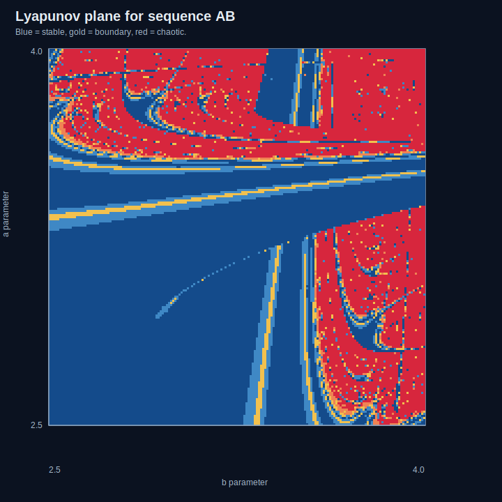
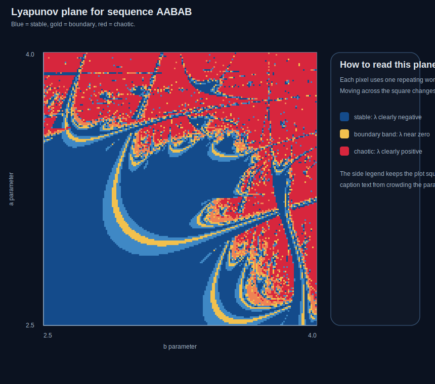
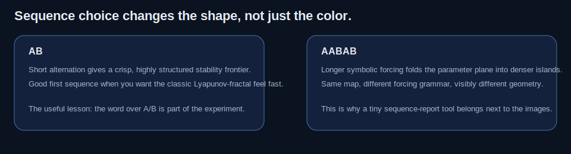
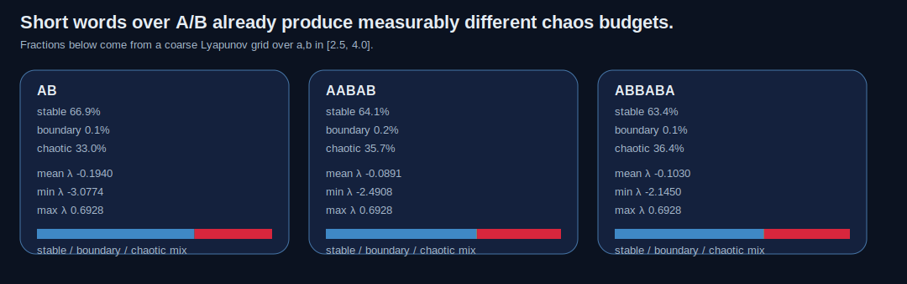
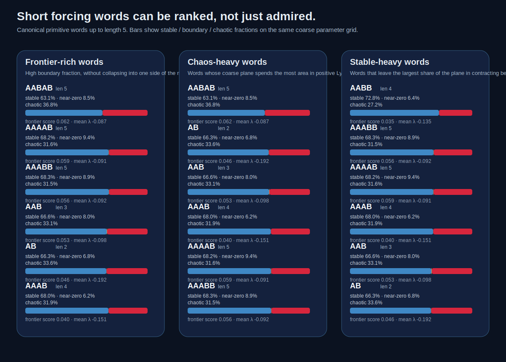
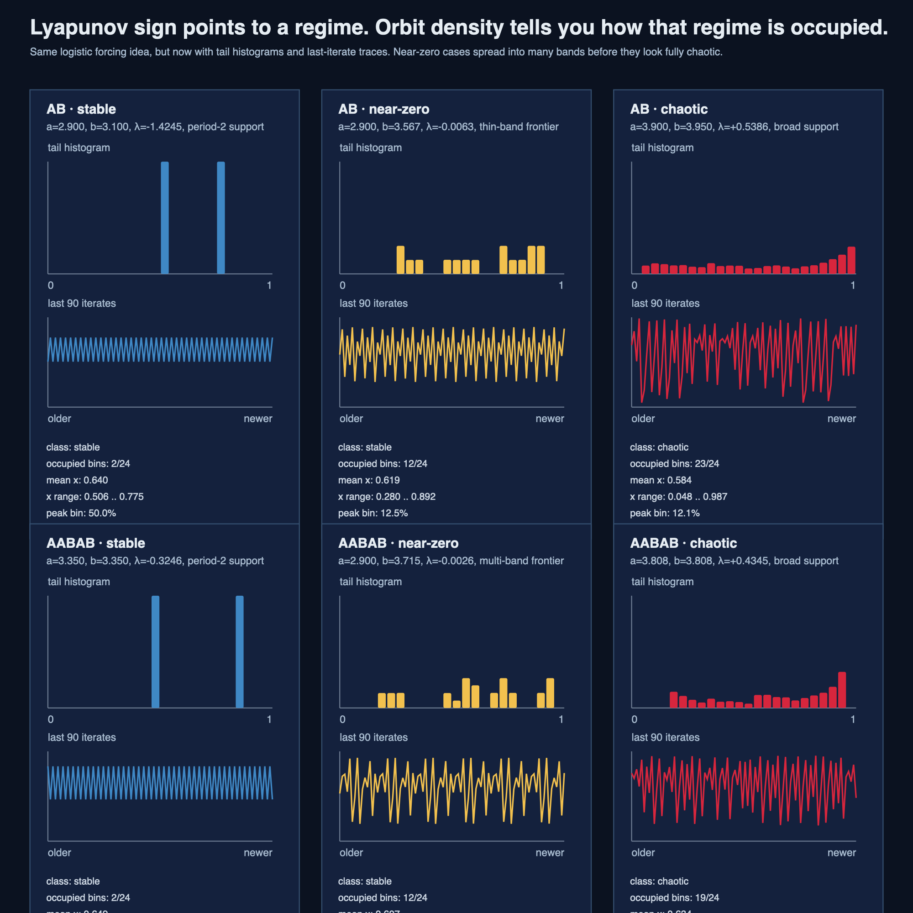

# Lyapunov Fractal Lab

A tiny chaos lab for one sharp idea: a logistic map driven by a repeating word over `A` and `B` turns stability itself into an image.

This repo opens with the smallest useful stack:
- a pure-Python core for Lyapunov exponents under symbolic forcing,
- an orbit-density layer for what the same forced orbit actually does after you pick one point,
- a CLI for single-point reports,
- a sequence-report CLI for side-by-side word comparisons or ranked short-word scans,
- generated SVG planes for two sequences plus a short-word ranking card and a new orbit-density sidecar,
- notebooks for the first pass and the new orbit-density read,
- and tests that keep the basic classification honest.

## What is here

- `lyaplab/core.py` computes Lyapunov exponents for logistic-map sequences like `AB` or `AABAB`.
- `lyaplab/orbit.py` tracks orbit tails and histogram support, so one `(a, b)` point can be read as an actual occupancy pattern instead of only a sign.
- `lyaplab/cli.py` reports the exponent and a coarse class for one parameter pair, with optional orbit-density metrics.
- `lyaplab/report.py` summarizes how much of a coarse parameter plane is stable, boundary-like, or chaotic for a chosen word.
- `lyaplab/wordscan.py` scans canonical primitive words and ranks them by frontier-richness, chaos share, or stability share.
- `lyaplab/report_cli.py` compares several words side by side or scans the short-word family.
- `scripts/generate_gallery.py` regenerates the gallery plus `reports/short-word-scan.md` and `reports/orbit-density-sidecar.md`.
- `notebooks/lyapunov-sequence-tour.ipynb` and `notebooks/lyapunov-orbit-density.ipynb` are the companion notebooks.
- `tests/test_core.py`, `tests/test_report.py`, and `tests/test_wordscan.py` keep the analysis honest.

## Why this repo is worth opening

The interesting object here is not just the logistic map.
It is the **word** that chooses which parameter comes next.

That word acts like a tiny forcing program.
Change the word, and the parameter plane changes shape.
So the experiment is half dynamics, half symbolic grammar.

## Gallery



`AB` is the fast entry point: strong contrast, recognizable islands, and a clean first Lyapunov plane.



`AABAB` already folds the same map into denser structure.
That is the thesis in picture form: sequence choice matters.





The report card puts numbers under the pictures, so "this word feels denser" becomes a measurable claim.



The short-word scan goes one step further and ranks the whole small family instead of hand-picking one favorite.

### Orbit-density sidecar



This new card answers the next obvious question after the sign field: once you choose one point in the plane, does the orbit collapse into two spikes, spread across a few thin bands, or fill most of the interval?

## Run it

Generate the gallery:

```bash
python3 scripts/generate_gallery.py
```

Query one point:

```bash
python3 -m lyaplab.cli AB 3.4 3.9
```

Query one point and include orbit-density metrics:

```bash
python3 -m lyaplab.cli AB 2.900 3.567 --with-orbit
```

Compare several words:

```bash
python3 -m lyaplab.report_cli AB AABAB ABBABA
```

Scan canonical primitive words up to length 5:

```bash
python3 -m lyaplab.report_cli --scan-short --max-length 5 --top 8
```

Run tests:

```bash
python3 -m unittest discover -s tests
```

## Notebook

Open `notebooks/lyapunov-sequence-tour.ipynb` for the first pass and `notebooks/lyapunov-orbit-density.ipynb` for the slower read on why Lyapunov sign is useful but still not the whole occupancy story.

## First conclusions

- negative Lyapunov exponent: nearby trajectories collapse and the forcing sequence lands in a stable regime
- positive Lyapunov exponent: nearby trajectories separate exponentially and the same sequence becomes chaotic
- changing the `A/B` word changes the geometry enough that the sequence belongs in the experiment description, not in a footnote
- even a coarse grid shows different chaos budgets for different words, so a word-level summary tool is useful, not decorative
- scanning canonical short words makes the repo less anecdotal: it now has a small search layer, not just chosen examples
- the new orbit-density sidecar adds the missing middle layer: Lyapunov sign is the right first cut, but it does not say whether the tail lives on two spikes, several thin bands, or a broad support set

## Best next moves

- add a notebook pass on why Lyapunov sign alone is useful but not the whole story
- push the short-word scan to one higher resolution tier for the strongest frontier-rich candidates

— Jarbas
